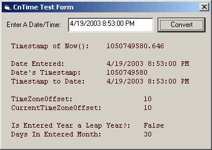



## UNIX Epoch Timestamp via API \(\+ Other Time\-Related Subs\) Updated\!

### Description

This module is a collection of various time functions, including the generation of GMT offset UNIX Epoch timestamps, Leap Year calculation, Days In Month calculation, and the completely unique GetTimeZoneOffset(), GetCurrentTimeZoneOffset() and isDaylightSavings() functions! I was unable to find any VB code for timestamp generation, so I had to make my own! Have you ever needed to compare dates that were created in two different countries? If so then you've probably run into the differences in dates in various regions of the world. The US formats dates as "mm/dd/yy" where as most of the rest of the world uses "dd/mm/yy". This is all fine and good, until you need to compare one to the other. According to VB's documentation, the date format is defined by the local systems settings. This has the effect of improper comparison when equating dates generated in two different regions. IE - is CDate("3/4/03") March 4th or April 3rd? VB makes the assumption that the date was generated on the local system, so if the local system's format is different then the system that generated the date it will be incorrect. It becomes even more fun when dealing with other languages! CDate("Mar 4, 2003") will generate an error on a non English machine as "Mar" is not a recognized month or abbreviation. Utilizing a GMT offset UNIX Epoch timestamp can avert this issue. The timestamp is the number of seconds that have elapsed since the epoch (January 1 1970 00:00:00 GMT). So instead of storing "3/4/03" you store "1046700000" which is the number of seconds between March 4th, 2003 and the epoch. Best of all, this module allows you to convert back from a timestamp into a date variable, allowing you to format it for the local user. ** In a nutshell, utilizing a timestamp in place of a locally formatted date will allow you to correctly compare dates no matter what language or format was used during the creation of either date you're attempting to compare. ** The other unique functionality of this module is the GetTimeZoneOffset(), GetCurrentTimeZoneOffset() and isDaylightSavings() functions. These allow you to determine the Time Zone Offset and Current Time Zone Offset of the local system. IE - Canberra, Australia is GMT + 10:00, so 10 is Canberra's Time Zone Offset. During summer daylight savings, Canberra's Current Time Zone Offset is 9. If you didn't follow that, then you'll probably never need this functionality (but it's in here if you do)! The rest of the functions are pretty standard, though well-commented and optimized functions concerning leap year and days in a month calculation. The module is pretty well tested, but your mileage may vary. Please leave a comment or send an email if you find a bug or have a new feature to add or request! Thank and enjoy! UPDATED - (Finially) fixed the leap year bug. Please let me know if you find any issues!
 
### More Info
 

             |
---                |---
**Submitted On**   |2003-04-21 10:11:48
**By**             |[Nick Campbeln](https://github.com/Planet-Source-Code/PSCIndex/blob/master/ByAuthor/nick-campbeln.md)
**Level**          |Intermediate
**User Rating**    |5.0 (55 globes from 11 users)
**Compatibility**  |VB 5\.0, VB 6\.0, VB Script
**Category**       |[Math/ Dates](https://github.com/Planet-Source-Code/PSCIndex/blob/master/ByCategory/math-dates__1-37.md)
**World**          |[Visual Basic](https://github.com/Planet-Source-Code/PSCIndex/blob/master/ByWorld/visual-basic.md)
**Archive File**   |[UNIX\_Epoch1762566262004\.zip](https://github.com/Planet-Source-Code/nick-campbeln-unix-epoch-timestamp-via-api-other-time-related-subs-updated__1-44845/archive/master.zip)

